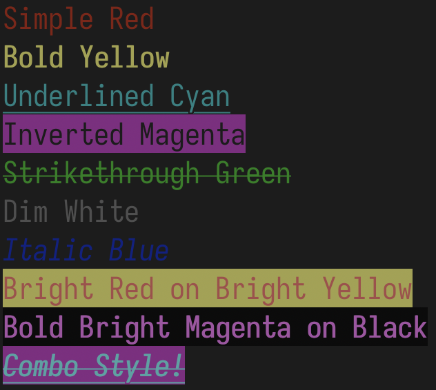

Simple Python class with ANSI escape codes for styling and coloring terminal output

---

## Installation

```sh
pip3 install pytermcolors
```

---

## Examples

```python
from pytermcolors import colprint, Color

colprint("Hello World!", fg=Color.FG_CYAN, bg=Color.BG_WHITE, bold=True, italic=True)
```

```python
from pytermcolors import colorize, Color

print(colorize("WARNING", fg=Color.FG_YELLOW, underline=True))
print(colorize("ERROR", fg=Color.FG_RED, strike=True))
```


